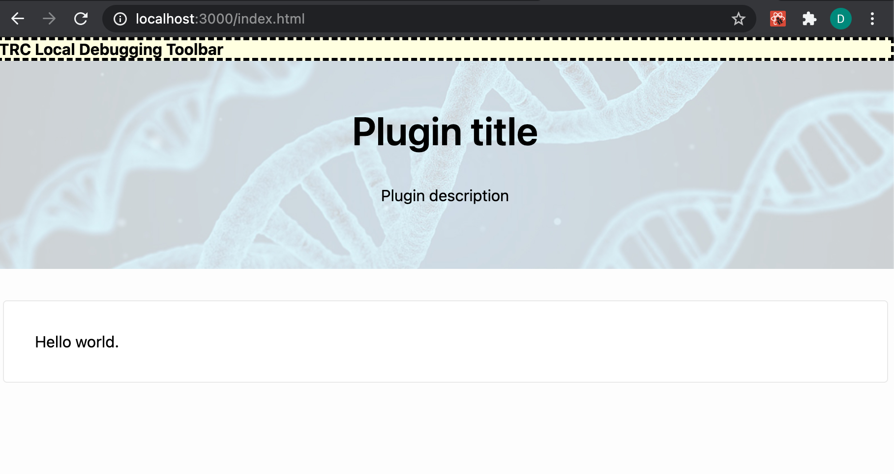

# SamplePlugin

## Basic Plugin Setup

Creating a plugin is as easy as copying another one, removing the parts you don’t need and moving from there. 

Plugins are built using NodeJs / Npm / TypeScript, and React. They run as Single Page Applications in the browser and talk to existnig  APIs. 
The sample has bootstrapping code to handle authentication. 

### Prerequisites

1. You can get trial data for a Voter Science account at https://start.voter-science.com/, which you can then use in your plugin. 

2. You will need Node / NPM (https://nodejs.org/en/download). 

3. You will need WebPack installed globally. You can see installed global packages by `npm list -g --depth 0` from your repo root. 

```
npm install -g webpack
npm install -g webpack-cli
```

The other packages, including TypeScript, are downloaded via the npm package dev dependencies. 

### TL;DR - running a plugin
You should be able to:
1. Clone this sample plugin
2. npm install
3. npm run build
4. npm run start 
5. Open `http://localhost:3000/index.html` in a browser.  

This will then prompt you for login, let you select a sheet that from your account, and then run the sample plugin against that sheet. 

However, for the sake of clarity, let’s walk through all the parts that make up the basic skeleton of a Voter Science plugin.

### Trouble shooting 

For any trouble shooting, you can see a successful build for this plugin on the CI at https://ci.appveyor.com/project/VoterScience/sampleplugin. 

You can also run `npm list -g --depth 0` to see which npm packages are installed globally. 


## package.json

```json
{
  "name": "trc-search",
  "version": "1.0.0",
  "description": "Trc plugin for district lookup",
  "main": "index.js",
  "scripts": {
    "test": "echo \"Error: no test specified\" && exit 1",
    "build": "webpack",
    "start": "npm run build && node node_modules/trc.runplugin/index.js dist"
  },
  "author": "",
  "license": "ISC",
  "dependencies": {
    "@emotion/core": "^10.0.28",
    "@emotion/styled": "^10.0.27",
    "react": "^17.0.1",
    "react-dom": "^17.0.1",
    "trc-analyze": "^1.6.0",
    "trc-react": "^4.1.4",
    "trc-sheet": "^1.12.0"
  },
  "devDependencies": {
    "@types/node": "^7.0.7",
    "@types/react": "^17.0.0",
    "@types/react-dom": "^17.0.0",
    "awesome-typescript-loader": "^5.2.1",
    "source-map-loader": "^0.2.4",
    "trc.runplugin": "^1.4.4",
    "typescript": "^3.9.3"
  }
}
```

This is a minimal version of `package.json` that almost all plugins share. Of notable importance is the `trc-react` library, which contains a lot of essential components that streamline plugin development.

## webpack.config.js, appveyor.yml and tsconfig.json

All plugins share the same `webpack.cofig.js`, `appveyor.yml` and `tsconfig.json` files.

These are updated example of the above files which you can simply copy:

- https://github.com/Voter-Science/SamplePlugin/blob/master/appveyor.yml
- https://github.com/Voter-Science/SamplePlugin/blob/master/tsconfig.json
- https://github.com/Voter-Science/SamplePlugin/blob/master/webpack.config.js

## Build output (`dist` folder)

The final build of the app is placed inside the dist folder. Every plugin should however already have at minimum an index.html file inside the folder.

This is the basic version of the file that every plugin should share:

```html
<!DOCTYPE html>
<html>
  <head>
    <meta charset="UTF-8" />
    <title></title>

    <link
      rel="stylesheet"
      href="https://trcanvasdata.blob.core.windows.net/code/pluginglobal.css"
    />
  </head>

  <body>
    <script>
      var _sheetRefGlobal = null;
    </script>

    <div id="app"></div>

    <script src="https://code.jquery.com/jquery-1.11.3.min.js"></script>

    <!-- Dependencies -->
    <script
      crossorigin
      src="https://unpkg.com/react@17/umd/react.development.js"
    ></script>
    <script
      crossorigin
      src="https://unpkg.com/react-dom@17/umd/react-dom.development.js"
    ></script>

    <!-- Main -->
    <script src="./bundle.js"></script>

    <script src="https://trcanvasdata.blob.core.windows.net/code2/plugin.js"></script>
    <script>
      // Well known entry point called by hosting infrastructure
      function PluginMain(sheetRef, opts) {
        _sheetRefGlobal = sheetRef;
        window.mainMajor.setSheetRef(sheetRef);
      }
    </script>
  </body>
</html>
```

You are allowed to extend this file freely if the need arises (for example if you need to include dependencies directly).

Of great importance is the `plugin.js` dependency (https://trcanvasdata.blob.core.windows.net/code2/plugin.js), which is responsible for handling authentication and initializing a sheet. For now you don’t need to know how it works, but you have to remember that all plugins need to include the above script and subsequent initialization snippet.

## Custom plugin logic (src folder)

Up until now we dealt with files that all plugins should share. You place the custom logic for your plugin inside the `src` folder inside an `index.tsx` file, which is the entry point of the plugin.

The following is a basic version of `index.tsx`:

```tsx
import * as React from "react";
import * as ReactDOM from "react-dom";

import { SheetContainer } from "trc-react/dist/SheetContainer";
import TRCContext from "trc-react/dist/context/TRCContext";
import { Panel } from "trc-react/dist/common/Panel";
import { PluginShell } from "trc-react/dist/PluginShell";

interface IState {}

export class App extends React.Component<{}, IState> {
  static contextType = TRCContext;

  render() {
    return (
      <PluginShell description="Plugin description" title="Plugin title">
        <Panel>Hello world.</Panel>
      </PluginShell>
    );
  }
}

ReactDOM.render(
  <SheetContainer fetchContents={false} requireTop={false}>
    <App />
  </SheetContainer>,
  document.getElementById("app")
);
```

The above implementation will give you a clean slate from which you can start to develop your own plugin.

Of notable importance are the following parts:

- `SheetContainer`: this component has to wrap the whole plugin, and is responsible for initializing sheet data and metadata. Of big importance is the fetchContents option, which if set to true will trigger the download of all the raw sheet data. Don’t use this option if you don’t need the data, since it can slow plugin initialization by a lot!
- `Context`: all the data and metadata that SheetContainer initializes is available inside React’s context, simply access it using this.context anywhere in the above component. Note: all the data is available already from first render!

For plugins that don't require the sheet API, the basic setup becomes even simpler. Simply remove `SheetContainer` and any reference to `TRCContext` as follows:

```tsx
import * as React from "react";
import * as ReactDOM from "react-dom";

import { Panel } from "trc-react/dist/common/Panel";
import { PluginShell } from "trc-react/dist/PluginShell";

interface IState {}

export class App extends React.Component<{}, IState> {
  render() {
    return (
      <PluginShell description="Plugin description" title="Plugin title">
        <Panel>Hello world.</Panel>
      </PluginShell>
    );
  }
}

ReactDOM.render(<App />, document.getElementById("app"));
```

## Running the plugin

If you followed all the steps, your folder structure should look like this:

- dist
  - index.html
- src
  - index.tsx
- appveyor.yml
- package.json
- tsconfig.json
- webpack.config.js

Running the plugin is now as simple as running `npm install` followed by `npm run start`.

If everything went smoothly, you should be able to access the plugin at http://localhost:3000/index.html:
(please note you must have this exact url, including the `index.html` suffix)


The above is the sheet selection screen. After selecting the desired sheet, your plugin will load with the corresponding sheet data ready to be used:



## Running a plugin skipping the sheet selection screen

Sometimes you will want to start a plugin and skip the sheet selection screen. This is useful when dealing with data that is not strictly a sheet.

In order to do that, you need to create a jwt.json file inside the root directory of the plugin.

This is an example:

```json
{
  "AuthToken": "your_auth_token",
  "Server": "https://TRC-login.voter-science.com",
  "SheetId": "q3001-1-5"
}
```

Now use the following command when running the plugin:

```
npm run start -- -auth ./jwt.json
```

This will allow you to skip the sheet selection screen and go directly to the plugin with the sheet (or other object) defined in SheetId already loaded.

## Using the debugger

- in `webpack.config.js` change `devtool` from `source-map` to `eval-source-map`

Now `debugger` statements won't be automatically deleted on build.

## Showing sheet data inside SimpleTable

SimpleTable is a powerful component from trc-react that allows you to display sheet data inside an interactive table.

Doing that is very simple:

1. Set the `fetchContents` option to `true`
2. Import SimpleTable from `trc-react`
3. render SimpleTable passing it `this.context._contents`

Result:


Final code:

```tsx
import * as React from "react";
import * as ReactDOM from "react-dom";

import { SheetContainer } from "trc-react/dist/SheetContainer";
import TRCContext from "trc-react/dist/context/TRCContext";
import { Panel } from "trc-react/dist/common/Panel";
import { PluginShell } from "trc-react/dist/PluginShell";
import { SimpleTable } from "trc-react/dist/SimpleTable";

interface IState {}

export class App extends React.Component<{}, IState> {
  static contextType = TRCContext;

  render() {
    return (
      <PluginShell description="Plugin description" title="Plugin title">
        <Panel>
          <SimpleTable data={this.context._contents} />
        </Panel>
      </PluginShell>
    );
  }
}

ReactDOM.render(
  <SheetContainer fetchContents={true} requireTop={false}>
    <App />
  </SheetContainer>,
  document.getElementById("app")
);
```


# Icons

Use Material Icons for geric icons. 
https://fonts.google.com/icons


Add to index.html: 
```
 <link
    href="https://fonts.googleapis.com/icon?family=Material+Icons"
    rel="stylesheet"
  />
```

Reference via class name. 
```
  <i className="material-icons"
    onClick={ ... }>
    person_add_alt_1</i>
```